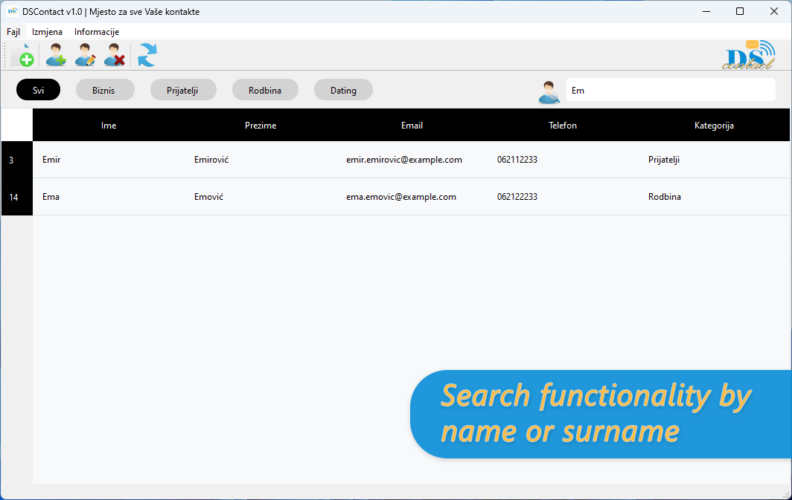

# 📞 DSContact 📧 All Your Contacts in One Spot

  

This application is my fourth major project developed as a part of my coursework at Internacionalna poslovno-informaciona akademija Tuzla. It was built using the Qt framework in C++ in collaboration with a fellow student.

---

### 👥 Project Contributors

<table>
  <tr>
    <td align="center" width="120">
      <a href="https://github.com/Sakib-Avdibasic">
         
        <strong>Sakib Avdibašić</strong>
      </a>
    </td>
    <td align="left">
      Co-developer of the DSContact project. Worked on core architecture, UI logic and CSV data handling.
    </td>
    <td align="left">
      <a href="https://github.com/Sakib-Avdibasic">GitHub</a> 
      <a href="https://www.linkedin.com/in/sakib-avdibasic/">LinkedIn</a>
    </td>
  </tr>
  <tr>
    <td align="center">
      <a href="https://github.com/demirhalilbasic">
         
        <strong>Demir Halilbašić</strong>
      </a>
    </td>
    <td align="left">
      Lead contributor. Designed UI, implemented CRUD logic, birthday automation and email integration.
    </td>
    <td align="left">
      <a href="https://github.com/demirhalilbasic">GitHub</a> 
      <a href="https://www.linkedin.com/in/demir-halilbasic/">LinkedIn</a> 
      <a href="https://www.youtube.com/@DemkyDesignHub">YouTube</a>
    </td>
  </tr>
</table>

---

The application displays a list of contacts that are loaded from a `contacts.csv` file upon startup. The user interface shows information such as first name, last name, email, phone number, and the contact category.

Key features of the application include full CRUD (Create, Read, Update, Delete) operations for managing contacts. Users can edit or delete existing contacts and add new ones. The application also allows importing contacts from a `.csv` file and exporting the current list, enabling users to save any changes made to the contact list.

The main screen offers a search function to find contacts by first or last name and the ability to filter and display contacts by category, such as "Business" or "Friends". When creating a new contact, users can assign a desired category or later update it.

One interesting feature is that double-clicking on a contact's email address opens a `mailto:` form, allowing users to send an email directly. Additionally, since each contact's date of birth is recorded, the app automatically generates a birthday greeting message ready to send when it is the contact's birthday.

Users can also create a completely new (empty) contact list. The application includes a history of changes (patchlist) and records the Qt environment in which it was developed.

The application boasts a modern design, with significant attention given to functionality and user experience (UX). Most interactions are performed through a graphical interface, showcased in the screenshots above.

---

## ▶️ YouTube Overview

---

## 👍 Feedback

We are grateful for your time in reviewing our contact management application. Your insights are invaluable to us, and we hope you will share any suggestions or feedback you may have. Thank you for your support!
